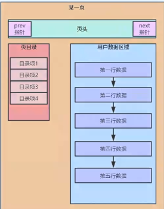

# 鲁班学院https://ke.qq.com/webcourse/index.html#cid=466664&term_id=100558501&taid=4122481409859304&vid=5285890796225238651
**问题**
1.什么是聚集索引？
2.为什么建议主键使用自增ID?
3.索引的本质是什么?
4.为什么会存在最左前缀原则?
5.一条SQL到底什么时候走索引?什么时候进行全表扫描？

## 1 Mysql索引的本质
**创建环境**
select version();
drop table t1;
create table t1(
a int primary key,
b int,
c int,
d int,
e varchar(20)
)engine=InnoDB;

insert into t1 values(4,3,1,1,'d');
insert into t1 values(1,1,1,1,'a');
insert into t1 values(8,8,8,8,'h');
insert into t1 values(2,2,2,2,'b');

insert into t1 values(5,2,3,5,'e');
insert into t1 values(3,3,2,2,'c');
insert into t1 values(7,4,5,5,'g');
insert into t1 values(6,6,4,4,'f');

create index idx_t1_bcd on t1(b asc,c desc,d desc);--创建索引
alter table `test`.`t1` drop index 'idx_t1_bcd';--删除索引

show index from t1;

注意：当创建一个表并且指定了主键时默认就会创建主键索引。

**小测试**
题目
select * from t1 where b = 1;
select * from t1 where c = 1;
select * from t1 where b = 1 and c = 1;
select * from t1 where c = 1 and b = 1;

select * from t1 where b > 1;
select * from t1 where b > 5;

select b from t1;
select b.e from t1;

select * from t1 where a = '1';
select * from t1 where e = '1';
select * from t1 where a = 1;
select * from t1 where a = 1;

select * from t1 limit 0,1000;
select * from t1 limit 5000,1000;

select * from t1 order by b asc,c asc,d asc;
select * from t1 order by b asc,c asc,d desc;

直接执行以下语句查询时是按照主键排序输出结果的
select * from t1;
  在InnoDB存储引擎中有“页”的概念，操作系统也有这个概念
  在操作系统中比如我们要想磁盘中取1kb的数据时，其实会取到4kb（操作系统页的单位）的数据，这就是局部性原理
  在我们的数据库InnoDB引擎中也是一样的，比如我们要取t1中a是7的数据，如果我们每次从磁盘中加载a=1到8共8次也就是8次I/O到内存是非常慢的，所以InnoDB中
加载数据时是以页为单位进行加载到内存，这个页单位大小是16kb。所以查询a=7的数据时可能就是一次I/O把1到8的数据加载到内存，然后CPU在从内存中选择a=7的数据
查看数据库页大小的语句：show global status like 'Innodb_page_size';
select 16384/1024;--16kb

页结构

页结构包括页头、页目录、数据区

可以分为：数据页和目录页 数据页中的数据区保存的是数据库中的数据，目录页中的数据区保存的就是页节点

在数据页中的页目录是对相应数据区的数据进行的分组，可以通过页目录进行快速查找。
同样目录页中可以快速对页节点进行查找

B+树特点
1个节点可以存多个数据（数的高度降低，，可以提交查找效率，避免多次IO）
所有非叶子节点元素都会冗余在叶子节点上
所有叶子节点都会被指针链接起来

可以看出来B+树中的每一个节点就是页结构中的一页

索引的本质其实就是一个数据结构，最终的目的就是帮助我们进行快速的查找
## 2 Mysql索引底层原理
主键索引：按照主键大小进行排序的索引，同时它还是一个聚集索引
聚集索引：用户数据和索引数据存储在一起，物理结构上也是存储在一起的。MYISAM中是分开存储的。
在InnoDB中主键索引和聚集索引是等价的。

基于叶子节点从左到右查找相等于全表扫描。从上到下查找就是索引查找
explain select * from t1 where a=5;

###create index idx_t1_bcd on t1(b,c,d);--创建索引
  创建了bcd索引图（bcd的B+Tree索引结构图，之前的主键索引是根据主键的值创建的B+Tree索引图），按照bcd的大小进行排序的。先比较b相等在比较c然后是d,索引图中的保存的也是bcd的值。
除此之外在叶子节点中还保存了主键的值。我们可以称bcd为二级索引或辅助索引。当辅助索引中没有我们需要的信息时就会回表，根据主键在主键索引
进行查找一条完整的数据

select * from t1 where b = 1 and c = 1;
（在bcd的B+Tree索引图的叶子节点中除了bcd的值外还会有一个对应的主键的值，这是为了回表进行除bcd之外信息的查找，例如select * ，如果把那些除bcd的值都放入到叶子节点也不好，会有太多的冗余数据，太占用存储空间）

###最左前缀原则

像下边的这条sql就不会走索引
explain select * from t1 where c = 1 and d = 1;
因为无法和bcd索引进行比较大小

以下语句可以走索引,只走了b的索引，key_length=5(空1+4个字节 b是int类型4个字节 b可以为空算1个字节 所以下来就是5个字节)，所以没有走d字段
explain select * from t1 where b = 1 and d = 1;

###以下语句将走主键索引，先找到a=1的，然后在叶子节点通过指针进行范围查找
explain select * from t1 where a > 1;

先分别找到a=1和a=5,然后在叶子节点上通过指针进行范围查找
explain select * from t1 where a>1 and a<5;

通过执行计划可以看到他可以走索引，但是没有走，走了全表扫描，因为我们是select *,这里还需要回表，根据这个例子b>1的有7条数据，需要回表7次。
如果全表扫描只需要4次即可，这样全表扫描更快，所以就没有走索引（这是mysql查询优化器在起作用，它会进行判断决策）
explain select * from t1 where b>1;
如果我们不是select * ,将走我们的bcd索引，因为不用回表了。这个也叫覆盖索引
explain select b from t1 where b>1;

将走索引，索引回表3次，比全表扫描更快。这个逻辑是通过查询优化器来实现的
explain select * from t1 where b>5;

我们分析以下sql是否会走索引，其实我们要查找b字段，这个字段有两种查询方式，
第一种是走我们的主键索引的叶子节点从左到右进行全表扫描，
第二种是走bcd索引B+tree的叶子节点从左到右进行查询。
真实情况下bcd索引中存储的叶子节点的数量可能要少于主键索引叶子节点的数量（因为bcd索引节点中存储的数据量就比主键索引叶子节点数据量少），
以下语句将会走bcd索引 ，可以发现type=index表示是可以走bcd索引的。从左到右进行扫描
explain select b from t1;

###create index idx_t1_e on t1(e);--创建e字段索引

会把字符型数据'1'转换成数字型1，所以会走索引
explain select * from t1 where a = '1';
本身就是数字型，所以会走索引
explain select * from t1 where a = 1;
两边数据类型相同，所以会走索引
explain select * from t1 where e = '1';

以下就不能走索引，因为我们创建e字段的时候是根据字符型的大小关系来进行创建的，现在和数字1进行比较，则需要将e进行数据类型转换，所以之前的索引就用不到了。
类似的还有对字段进行数据运行后查询也会运用不到索引，比如select * from t1 where a+1=2;
explain select * from t1 where e = 1;

###补充知识点
select 1=1;
select 0='a';
在mysql中比较两个不同类型的数据时会先进行类型转换，一般都是把字符型数据转换成数字，如果是数字的字符型直接转换成对应的数字。如果是字母的字符型数据都会
转换成数字0，所以以上两个sql都返回的是1.
如果我们有一条记录a=0,但是我们进行查询时是select * from t1 where a = 'a';就会把a=0的数据查询出来。

## 3 Mysql索引优化实战
###mysql分页查询
取第1条数据后边的1000条数据，需要确定第一条数据。在主键索引中进行查找，越往后，越慢
select * from t1 limit 1,1000;
取第1000条数据后边的1000条数据
select * from t1 limit 1000,1000;
取第10000条数据后边的1000条数据
select * from t1 limit 10000,1000;
我们可以在查询每页数据时把上一页最大的主键值记录下来，后续在查找的时候带上主键值，加到where中利用主键索引来缩小要查询的数据量。

###order by 
explain select * from t1 order by b asc,c asc,d asc
以上语句的执行过程：
首先将我们的8条数据bcd取出来放到sort_buff中。数据较少直接反倒sort_buff中，如果较多就会利用文件排序。
因为我们是select * ,需要回表，所以就不会走bcd索引，bcd索引的叶子节点其实已经对bcd字段进行了排序的。所以就会走全表扫描进行内存排序
如果改成以下语句就会走索引,直接按照索引进行排序返回，Extra里是Using index
explain select b from t1 order by b asc,c asc,d asc

在mysql8之前只是语法层面支持降序索引，不管你创建索引的时候写的是asc还是desc.最终都是用asc进行排序的。所以mysql8之前只能建立升序索引。
在mysql8里面就真正的支持了降序索引
create index idx_t1_bcd on t1(b asc,c desc,d desc);
在mysql8中执行以上创建索引的语句后，就会根据bcd各自的排序规则画出叶子节点，最终就会生成一个降序索引的b+树。就会支持cd字段降序条件的索引

## 总结
1.建立索引就是对数据进行排序，排序就是比较大小，B+树其实就是帮助我们排序的一种数据结构
2.where条件能否利用索引本质上就是看此条件能不能和某个B+树索引进行比较大小
3.最左前缀原则：本质上就是对由多个字段联合组成的复合字段进行比较大小，类似字符串比较大小，只有给定了最左侧的字段，才能去比较后续的字段。
4.全表扫描：在InnoDB中，表中所有行数据都在主键索引的叶子节点中，所以全表扫描就是扫描主键索引的叶子节点。
5.覆盖索引：对于某一个SQL在执行时，如果发现所要查询的数据在某一个索引上也存在时（除开主键索引），那么就可以直接利用这个索引进行查询获取数据，而不需要回表。
6.索引条件(Index Condition):当某些条件因为不符合最左前缀原则时，无法参与索引的执行时，在Mysql5.7之前，该条件会在索引数据回表后在mysql Server层执行然后
过滤数据；而在mysql5.7后，该条件会在索引执行后，回表前执行过滤动作，相当于该条件的执行下沉了，也可叫索引条件下推。
7.在Mysql中，数字与字符串进行运算时，统一会将字符转换成数字，非数字字符串统一转换为0

## 思考题
1.为什么我们通常说拥有2000万条数据以上的表就是大表？
当B+树的高度为3时，最多可以存储2000万多的数据，如果继续添加会导致B+树高度增加，查找效率降低
2.为什么使用Mysql的limit分页时，页数越后执行越慢？能利用索引优化吗？
3.在创建索引时，需要考虑哪些因素，在选择字段时需要考虑哪些因素？
4.索引与mysql中的锁有关系吗？
5.查询优化器是如何优化SQL和选择索引的？

