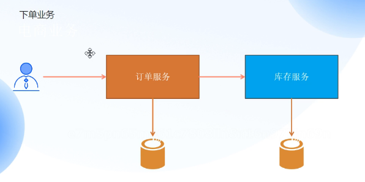
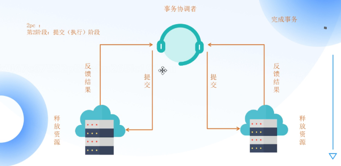

# 课程介绍

#分布式事物应用场景

支付回调服务

下单业务

#事物的概念

## 什么是事务

## 事务特性以及实现方式

C和I是通过锁来实现的
A和D是通过日志来保证的（redo、undo日志）

以前JDBC时写事务的方法，分布式事务也有类似的写法

后来我们事务的写法

#分布式事物概念

#分布式事物思路分析

# XA规范

XA规范就类似JDBC规范，也有对应的数据库厂商进行实现。

#  2pc提交协议

2阶段的缺点

# 2pc缺点的解决

单点故障：通过集群的方案来解决
阻塞资源：有阻塞资源就是因为我们在第一个阶段中开启事务后占用资源，在第二个阶段才进行提交或回滚导致，那如果
        我们在第一个阶段直接提交不就可以了嘛，但是那第二个阶段如果要进行回滚该怎么办？其实只要在第一个阶段记住原始数据就好
        seata就是这么对两阶段进行优化的。
数据不一致问题：人工介入

# 3pc提交协议

在2阶段的时候，我们第1阶段就会开启事务，占用资源了，但是有可能在第1个阶段就会执行出错，白白占用资源，所以就有3阶段的出现。
在3阶段的时候，我们第一个阶段就会询问是否可以执行，收到请求后并不会执行sql并且不会占用资源，仅仅是判断自己是否可以做，如果可以就返回，在第2个阶段后才会
开始执行sql，占用资源，这个步骤就和2阶段的第一个步骤一样了。

## can commit执行结果分析

如果can commit返回了异常信息

就会执行abort commit 放弃后续的流程

## pre commit执行结果分析

异常

异常时需要放弃且回滚，和can commit异常后的处理不同

## 参与者超时的情况
参与者只在第二阶段和第三阶段超时

在第二阶段超时直接取消回滚
在do commit阶段超时时会进行提交，因为是一个概率问题，前2个阶段都成功了，大概率第三个阶段会进行提交。

三阶段在实际中运用的不多。
三阶段是对二阶段的一个优化
1.优化了二阶段在第一个步骤出错时的一个资源浪费
2.添加了参与者超时的一个处理机制

#  tcc解决方案

为什么有TCC？

比如我们有一个redis和一个mysql组合存储的一个业务逻辑方法，
在执行redis时出错了，那么我们怎么回滚redis呢，tcc就可以

# 事件表解决方案

将两个大框中分布式服务的事务拆分成4个小的本地事务（1-*，2-*，3-*，4-*）
每个小的事务是完整的，那么整个大事务就是完整的
这个方案的好处就是降低了用户的响应时间RT

# 最大努力通知方案

