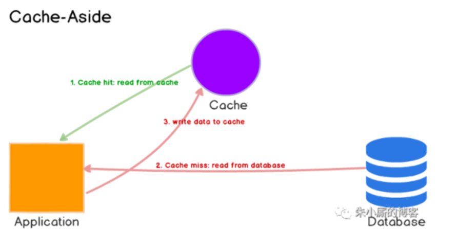
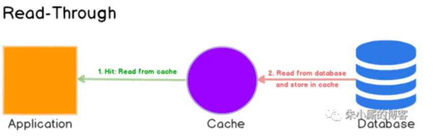
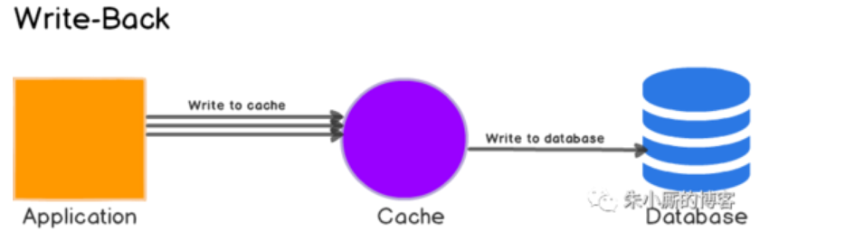

#1.常用的缓存策略有哪些？如何做到缓存(如redis)与DB中数据的一致性，你们项目中用到了什么缓存系统下，如何设计的？
常用缓存策略：
## 第一种：Cache-Aside
缓存位于一边，应用程序直接与缓存和数据库和数据库对话

解释：
 * 应用程序首先检查缓存
 * 如果在缓存中找到，表示已经命中缓存。数据被读取并返回给应用程序
 * 如果在缓存中没有找到，则未命中缓存。应用程序必须做一些额外的工作，它需要查询数据库来读取数据，将数据返回给客户端，然后还要将数据存储在缓存中，
这样对相同数据的后续读取可以命中缓存。

Cache-aside策略特别适合读多的应用场景。使用Cache-aside的系统对缓存失效具有一定的弹性。如果缓存集群宕机，系统仍然可以通过直接访问数据库进行操作。(不过，如果缓存在峰值负载期间下降，这也没有多大帮助。响应时间可能会变得很糟糕，最糟糕的情况是，数据库可能会停止工作。)

另一个优点在于缓存中的数据模型可以与数据库中的数据模型不同。例如，多个查询产生的响应可以存储在某个请求id上。

当使用cache-aside时，最常见的写策略是直接将数据写到数据库中。当这种情况发生时，缓存可能与数据库不一致。为了解决这个问题，开发人员通常会引入TTL，并继续提供陈旧的数据，直到TTL过期。如果必须保证数据的新鲜度，开发人员要么使缓存条目无效，要么使用适当的写策略，我们将在后面讨论。

## 第二种：Read-Though Cache
Read-though策略下的缓存与数据库保持一致。当缓存丢失时，它从数据库加载相应的数据，填充缓存并将其返回给应用程序（参考下图）。

cache-aside和read-through策略都是延迟加载数据的，也就是说，只在第一次读取数据时才加载数据。

虽然read-through和cache-aside非常相似，但至少有两个关键区别:

在cache-aside中，应用程序负责从数据库中获取数据并填充缓存。在read-through中，此逻辑通常由库或独立缓存提供程序支持；

与cache-aside不同，read-through cache中的数据模型不能与数据库中的数据模型不同。

当多次请求相同的数据时，read-through缓存最适合于读量较大的工作负载。例如，一个新闻故事。缺点是，当第一次请求数据时，它总是导致缓存丢失，并导致额外的数据加载到缓存的代价。

开发人员通过手动发出查询来“预热”或“预热”缓存来处理这个问题。就像cache-aside一样，数据也可能在缓存和数据库之间变得不一致，而解决方案就在写策略中，我们将在接下来看到这一点。

## 第三种：Write-Though

在这种写策略中，首先将数据写入缓存，然后写入数据库。缓存与数据库保持一致，写操作总是通过缓存到达主数据库。

就其本身而言，write-through缓存似乎没有多大作用，实际上，它们引入了额外的写延迟，因为数据先写到缓存，然后写到主数据库。但是，当与read-through结合使用时，我们获得了read-through的所有好处，还获得了数据一致性保证，使我们不必使用缓存失效技术。

## 第四种 Write-Around

这种策略下，数据直接写入数据库，只有读取的数据才能进入缓存。Write-around可以与read-through结合使用，并在数据只写一次、读取次数较少或从不读的情况下提供良好的性能。例如，实时日志或聊天室消息。同样，这个模式也可以与cache-aside组合使用。

## 第五种 Write-Back

这种策略下，应用程序将数据写入缓存，缓存会立即确认，并在延迟一段时间后将数据写入数据库。有时这种策略也被称为write-behind。

Write-back缓存提高了写性能，对于写工作量大的工作负载非常有用。当与read-through相结合的时候，它对于混合工作负载非常有效，最近更新和访问的数据总是在缓存中可用。它对数据库故障具有很大程度上的弹性，可以容忍一些数据库的宕机。如果支持批处理或合并，则可以减少对数据库的总体写操作，这将减少负载并降低成本。

一些开发人员使用 Redis 时，同时采用了cache-aside和write-back两种策略，以便更好地吸收峰值负载期间的峰值。主要缺点是，如果缓存失效，数据可能会永久丢失。大多数关系数据库存储引擎(例如InnoDB)的内部都默认启用了回写缓存。查询首先写入内存，最后刷新到磁盘。

总结

在本文中，我们探讨了不同的缓存策略及其优缺点。在实践中，请仔细评估您的目标，理解数据访问(读/写)模式，并选择最佳策略或组合策略。

如果你选错了怎么办？一个与你的目标或访问模式不匹配的？您可能会引入额外的延迟，或者至少没有看到全部的好处。例如，如果在实际应该使用write-around/read-through时选择write-through/read-through(访问写入数据的频率较低)，那么缓存中就会有无用的垃圾。

可以说，如果缓存足够大，它可能没问题。但在许多实际的高吞吐量系统中，当内存永远不够大并且需要考虑 服务器 成本时，正确的策略很重要。

如何保障数据的一致性

1.延迟双删
2.异步延迟删除

https://blog.csdn.net/chang384915878/article/details/86756463
https://zhuanlan.zhihu.com/p/91770135

#2.如何防止缓存的雪崩和击穿
https://blog.csdn.net/lxw1844912514/article/details/106687360

#3缓存数据过期后的更新如何设计

