# 同事乱用分页 MySQL 卡爆，我真是醉了...
引用https://mp.weixin.qq.com/s/nV33fmA1kaeD7lMR5XORNg

## 背景
一天晚上10点半，下班后愉快的坐在在回家的地铁上，心里想着周末的生活怎么安排。
突然电话响了起来，一看是我们的一个开发同学，顿时紧张了起来，本周的版本已经发布过了，这时候打电话一般来说是线上出问题了。
果然，沟通的情况是线上的一个查询数据的接口被疯狂的失去理智般的调用，这个操作直接导致线上的MySql集群被拖慢了。
好吧，这问题算是严重了，下了地铁匆匆赶到家，开电脑，跟同事把Pinpoint上的慢查询日志捞出来。看到一个很奇怪的查询，如下

`1 POST domain/v1.0/module/method?order=condition&orderType=desc&offset=1800000&limit=500`


domain、module 和 method 都是化名，代表接口的域、模块和实例方法名，后面的offset和limit代表分页操作的偏移量和每页的数量，也就是说该同学是在 
翻第（1800000/500+1=3601）页。初步捞了一下日志，发现 有8000多次这样调用。
这太神奇了，而且我们页面上的分页单页数量也不是500，而是 25条每页，这个绝对不是人为的在功能页面上进行一页一页的翻页操作，而是数据被刷了（说明下，
我们生产环境数据有1亿+）。详细对比日志发现，很多分页的时间是重叠的，对方应该是多线程调用。
通过对鉴权的Token的分析，基本定位了请求是来自一个叫做ApiAutotest的客户端程序在做这个操作，也定位了生成鉴权Token的账号来自一个QA的同学。
立马打电话给同学，进行了沟通和处理。

## 分析
其实对于我们的MySQL查询语句来说，整体效率还是可以的，该有的联表查询优化都有，该简略的查询内容也有，关键条件字段和排序字段该有的索引也都在，
问题在于他一页一页的分页去查询，查到越后面的页数，扫描到的数据越多，也就越慢。
我们在查看前几页的时候，发现速度非常快，比如  limit 200,25，瞬间就出来了。但是越往后，速度就越慢，特别是百万条之后，卡到不行，
那这个是什么原理呢。先看一下我们翻页翻到后面时，查询的sql是怎样的：

`1 select * from t_name where c_name1='xxx' order by c_name2 limit 2000000,25;`

这种查询的慢，其实是因为limit后面的偏移量太大导致的。比如像上面的 limit 2000000,25 ，这个等同于数据库要扫描出 2000025条数据，然后再丢弃前面的 
20000000条数据，返回剩下25条数据给用户，这种取法明显不合理。

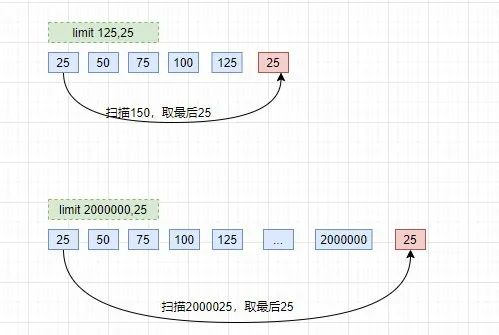

大家翻看《高性能MySQL》第六章：查询性能优化，对这个问题有过说明：

分页操作通常会使用limit加上偏移量的办法实现，同时再加上合适的order by子句。但这会出现一个常见问题：当偏移量非常大的时候，
它会导致MySQL扫描大量不需要的行然后再抛弃掉。


## 数据模拟

那好，了解了问题的原理，那就要试着解决它了。涉及数据敏感性，我们这边模拟一下这种情况，构造一些数据来做测试。

* 1、创建两个表：员工表和部门表

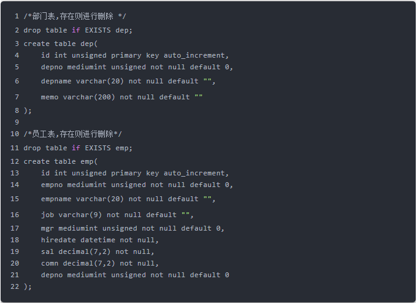

* 2、创建两个函数；生成随机字符串和随机编号

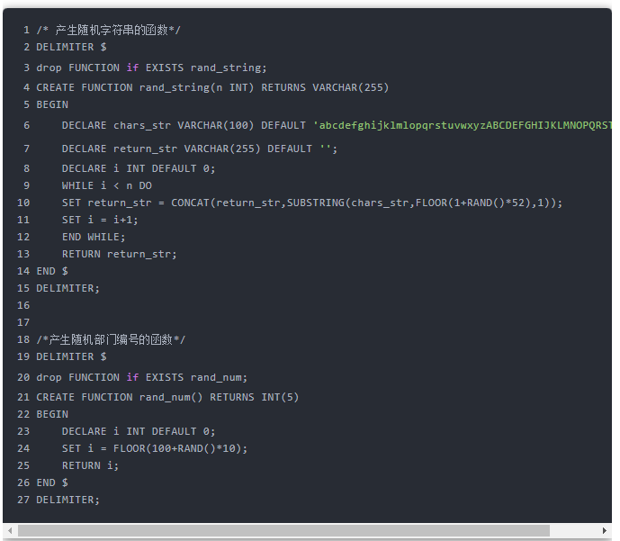

* 3、编写存储过程，模拟500W的员工数据

```sql
 1 /*建立存储过程：往emp表中插入数据*/
 2 DELIMITER $
 3 drop PROCEDURE if EXISTS insert_emp;
 4 CREATE PROCEDURE insert_emp(IN START INT(10),IN max_num INT(10))
 5 BEGIN
 6     DECLARE i INT DEFAULT 0;
 7     /*set autocommit =0 把autocommit设置成0，把默认提交关闭*/
 8     SET autocommit = 0;
 9     REPEAT
10     SET i = i + 1;
11     INSERT INTO emp(empno,empname,job,mgr,hiredate,sal,comn,depno) VALUES ((START+i),rand_string(6),'SALEMAN',0001,now(),2000,400,rand_num());
12     UNTIL i = max_num
13     END REPEAT;
14     COMMIT;
15 END $
16 DELIMITER;
17 /*插入500W条数据*/
18 call insert_emp(0,5000000);
```
* 4、编写存储过程，模拟120的部门数据

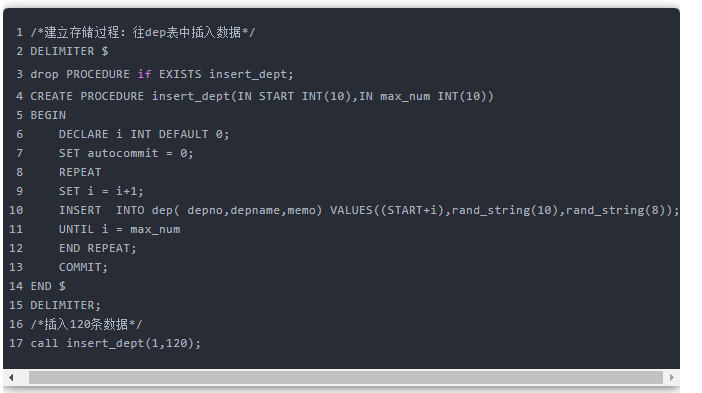

* 5、建立关键字段的索引，这边是跑完数据之后再建索引，会导致建索引耗时长，但是跑数据就会快一些。

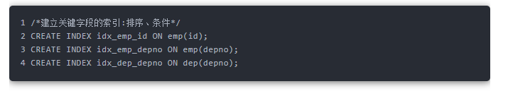

## 测试

测试数据

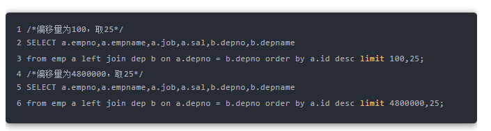

执行结果

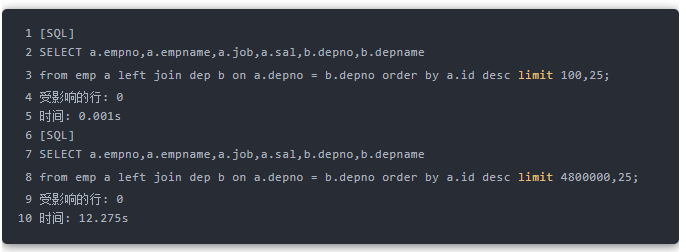

因为扫描的数据多，所以这个明显不是一个量级上的耗时。另外，MySQL 系列面试题和答案全部整理好了，微信搜索互联网架构师，在后台发送：面试，可以在线阅读。


## 解决方案

### 1、使用索引覆盖+子查询优化
因为我们有主键id，并且在上面建了索引，所以可以先在索引树中找到开始位置的 id值，再根据找到的id值查询行数据。

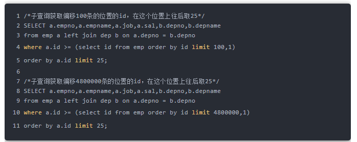

执行结果

执行效率相比之前有大幅的提升：

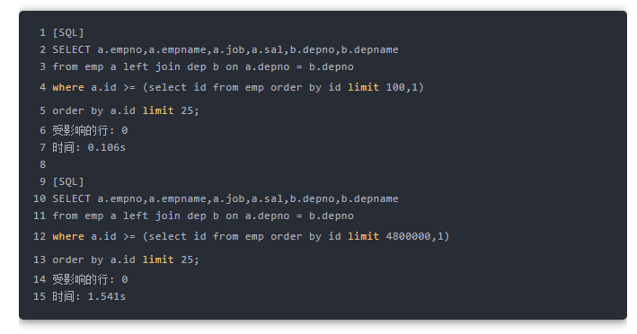

### 2、起始位置重定义

记住上次查找结果的主键位置，避免使用偏移量 offset

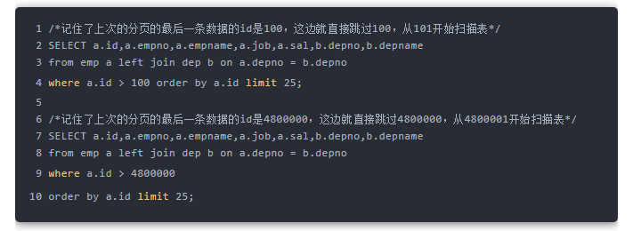

执行结果

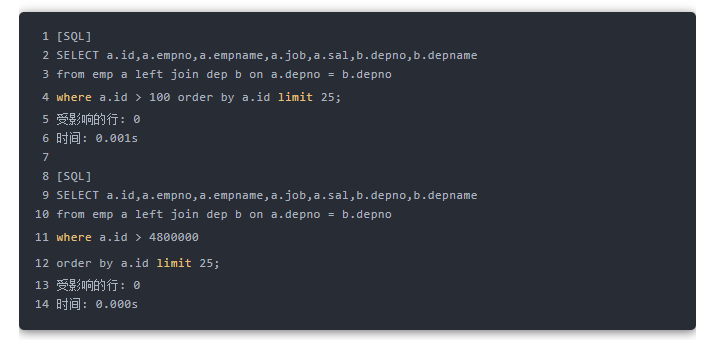

这个效率是最好的，无论怎么分页，耗时基本都是一致的，因为他执行完条件之后，都只扫描了25条数据。

但是有个问题，只适合一页一页的分页，这样才能记住前一个分页的最后Id。如果用户跳着分页就有问题了，比如刚刚刷完第25页，马上跳到35页，数据就会不对。

这种的适合场景是类似百度搜索或者腾讯新闻那种滚轮往下拉，不断拉取不断加载的情况。这种延迟加载会保证数据不会跳跃着获取。

### 3、降级策略
看了网上一个阿里的dba同学分享的方案：配置limit的偏移量和获取数一个最大值，超过这个最大值，就返回空数据。

因为他觉得超过这个值你已经不是在分页了，而是在刷数据了，如果确认要找数据，应该输入合适条件来缩小范围，而不是一页一页分页。

这个跟我同事的想法大致一样：request的时候 如果offset大于某个数值就先返回一个4xx的错误。

## 小结

当晚我们应用上述第三个方案，对offset做一下限流，超过某个值，就返回空值。第二天使用第一种和第二种配合使用的方案对程序和数据库脚本进一步做了优化。

合理来说做任何功能都应该考虑极端情况，设计容量都应该涵盖极端边界测试。另外，关注公众号互联网架构师，在后台回复：2T，可以获取我整理的 Java 系列面试题和答案，非常齐全。

另外，该有的限流、降级也应该考虑进去。比如工具多线程调用，在短时间频率内8000次调用，可以使用计数服务判断并反馈用户调用过于频繁，直接给予断掉。

哎，大意了啊，搞了半夜，QA同学不讲武德。

不过这是很美好的经历了。


