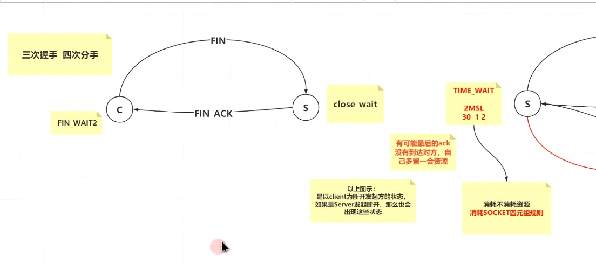
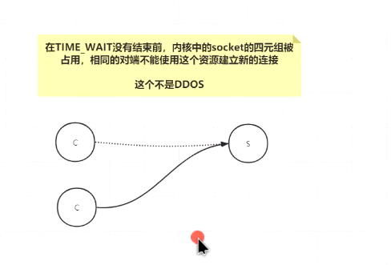
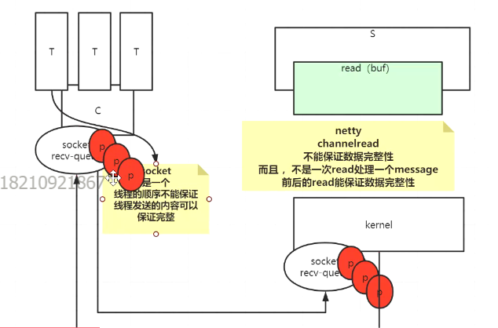
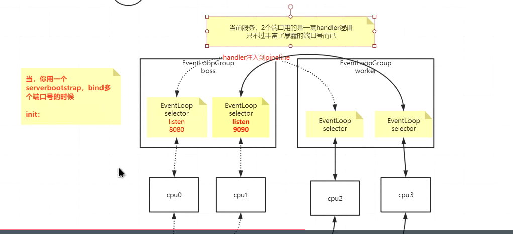
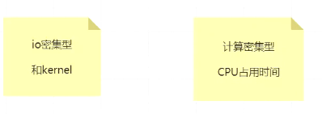
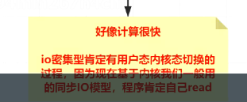
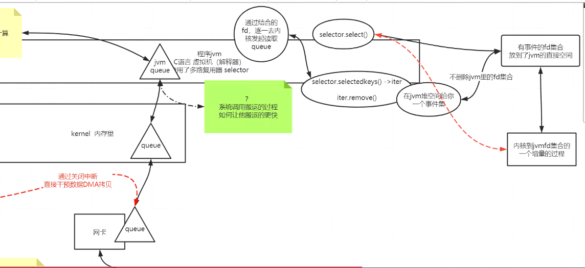

###演示SocketMultiplexingSingleThreadv1
分两种IO模式演示
使用Poll模式
javac SocketMultiplexingSingleThreadv1.java && strace -ff -o poll 
java -Djava.nio.channels.spi.SelectorProvider=sun.nio.ch.PollSelectorProvider SocketMultiplexingSingleThreadv1
分析追踪文件poll的输出信息

使用epoll模式 启动时不加-D默认就使用性能更好的epoll模式
分析追踪epoll的输出信息

懒加载：
其实再触碰到selector.select()调用的时候触发了epoll_ctl的调用

###演示四次分手

以下演示都使用这个程序：
SocketMultiplexingSingleThreadv1
####服务器程序中不调用客户端close方法
1.启动服务端程序
javac SocketMultiplexingSingleThreadv1.java && strace -ff -o poll java -Djava.nio.channels.spi.SelectorProvider=sun.nio.ch.PollSelectorProvider SocketMultiplexingSingleThreadv1
2.在开启一个窗口，输入
netstat -natp
观察启动了一个监听的程序
tcp6       0      0 :::9090                 :::*                    LISTEN      33723/java
3.在另一个窗口用nc测试
nc localhost 9090
4.在使用命令netstat -natp观察
tcp6       0      0 :::9090                 :::*                    LISTEN      33723/java          
tcp6       0      0 ::1:37871               ::1:9090                ESTABLISHED  33733/nc                   
tcp6       0      0 ::1:9090                ::1:37871               ESTABLISHED  33723/java
可以发现已经建立了连接，
5.在nc测试端的窗口输入Ctrl+C结束程序
6.再次用netstat -antp观察输出结果
tcp6       0      0 :::9090                 :::*                    LISTEN      33723/java          
tcp6       0      0 ::1:37871               ::1:9090                FIN_WAIT2   -                   
tcp6       0      0 ::1:9090                ::1:37871               CLOSE_WAIT  33723/java
nc客户端程序的状态为FIN_WAIT2,服务端的状态是CLOSE_WAIT

####服务器中调用客户端close方法
1.启动服务端程序
javac SocketMultiplexingSingleThreadv1.java && strace -ff -o epoll java SocketMultiplexingSingleThreadv1
2.在开启一个窗口，输入
netstat -natp
观察启动了一个监听的程序
tcp6       0      0 :::9090                 :::*                    LISTEN      33723/java
3.在另一个窗口用nc测试
nc localhost 9090
4.在使用命令netstat -natp观察
tcp6       0      0 :::9090                 :::*                    LISTEN      33723/java          
tcp6       0      0 ::1:37869               ::1:9090                ESTABLISHED 33792/nc            
tcp6       0      0 ::1:9090                ::1:37869               ESTABLISHED 33723/java
可以发现已经建立了连接，
5.在nc测试端的窗口输入Ctrl+C结束程序
6.再次用netstat -antp观察输出结果
tcp6       0      0 ::1:37869               ::1:9090                TIME_WAIT  -
nc客户端程序的状态为TIME_WAIT,服务端其实也有一个一瞬间的状态是CLOSED
这个TIME_WAIT 状态会持续一会（2MSL MSL可能是30秒 1分钟 或2分钟）就消失了
有可能最后的ack没有到达对方，自己会在内核中多留一会资源（在多留一会的这个时间段中也是消耗资源的，
消耗的资源主要是socket四元组的规则）
将内核参数net.ipv4.tcp_tw_reuse设置为1时可以重复使用

以上是以clent为断开发送方的状态，如果是Server发起断开，那么也会出现这些状态

###演示SocketMultiplexingSingleThreadv1_1（其中read、write的key.cancel()方法都被注释了）
在这个例子中read、write都是在一个线程中处理的，没有什么问题，
在下边的例子中我们把read、write分别写在另一个线程中，看看什么情况，

###演示SocketMultiplexingSingleThreadv2
演示SocketMultiplexingSingleThreadv1的第二个版本演示
在这个版本中会加入多线程的处理

写事件其实时和send-queue有关系的，如果send-queue是空的，就一定会给你返回可以写的
的事件，就会回调我们写方法
你真的要明白，什么时候写？不是依赖send-queue是不是有空间
1.你住半年好要写什么了，这是第一步
2.第二步你才关心send-queue是否有空间
3.所以，读 read一开始就要注册，但是write依赖以上关系，什么时候用什么时候注册
4.如果一开始就注册了write事件，进入死循环，一直调起！

这个版本中read、write事件分别另起线程来处理，经过测试发现，readHandler、writeHandler被一直调用。
即便以抛出了线程去读取，但是在时差里，这个key的read事件会被重复触发
我们把readHandler中的key.cancel()方法打开后，经过测试readHandler只会被调用一次，但是writerHandle还是被一直调用。
所以在writerHandler中也要把key.cancel()注释打开。

需要注意的是iter.remove();这个代码的意思就是remove掉用户程序结果集中的值，并不是remove掉多路复用器或者内核中的结果

以上问题的处理方式（打开key.cancel()）有点不好，会频繁的在
epoll_ctl add和epoll_ctl del之间一直注册和取消。

但是我们又想用多线程，又不想频繁的进行注册和取消
（注册了取消都是调用了epoll_ctl的add和del 都是系统调用），该怎么办？

可以将N个FD分组，每一组一个selector，将一个selector压到一个线程上。最好的线程数量是：cpu*2
其实但看一个线程：里面有一个selector，有一部分FD,且他们是线性的多个线程，他们在自己的cpu上执行，
代表会有多个selector在并行，且线程内是线性的。最终是并行的fd被处理
但是，你要明白，还是一个selector中的fd要放到不同的线程并行，从而造成cancel调用的嘛？不需要了

上边的逻辑其实就是分治，我的程序如果有100w个连接，如果有4个线程（selector），每个线程处理250000，
那么，可不可以拿出一个线程的selector就只关注accept，然后把接收的客户端的FD，分配给其他线程的selector

这个其实就是程序SocketMultiplexingThreads的示例

###SocketMultiplexingThreads示例
仿照netty进行关键代码的书写
知识点：
1.目的是让每个fd在单独的selector中线程执行，多个selector在不同线程张并发执行
2.如果先执行selector.select()，则在其后执行的s.register(st.selector, SelectionKey.OP_ACCEPT);会被阻塞的！！！！
执行完selector.wakeup()，selector.select()才会返回

演示了3中模式
第一种，混杂模式：线程组不明确分工，即处理accept也处理read\write
第二种，0号线程处理accept,其余线程处理read/write
第三种，分为boss线程组和worker线程组，boss线程组处理accept，worker线程组处理read/writer

###初级使用netty
再之前的IO模型中，我们有几个重要的概念
ByteBuffer、Channel、Selector
再netty中有与之对应的，netty进行了封装
比如ByteBuffer再netty中就是ByteBuf,这个ByteBuf 还多了一个pool的概念，可以选择是否池化。再以前的ByteBuffer中只能是堆内或堆外

######先测试ByteBuf
参见MyByteBuf

可以使用nc -l ip port 启动一个服务

基于事件或者说响应式编程 selector

######netty的客户端和服务端最基础代码编写
参见MyNetty#clientMode()和serverMode()

######netty的官方客户端和服务代码编写
利用Bootstrap和Boot
参见MyNetty#nettyClient

###通过RPC的例子演示netty的使用
参见rpc目录

##总结Netty模型

###第一种模型

### 第二种模型

### 第三种模式

## IO密集型和内核

